# Blender Generator

This is a learning project which aims to create procedural mesh that will be rendered in Blender.

## Features

| Feature               | Progress                                                       |
|-----------------------|----------------------------------------------------------------|
| Procedural meshes     | Torus                                                          |
| Marching cubes        | Done (slow version)                                            |
| Isosurface rendering  | Done (See implemented objects in objectS/IsoSurfaceGenerator.py|
| L - System            | In dev                                                         |
| Terrain generator     | Done                                                           |

### Procedural meshes

This project allows to create a torus mesh based on its formula and to render it 
thanks to Blender :

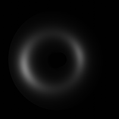

### Marching cubes

The marching cubes algorithm is used to created mesh from sdf functions such as the 3D Mandelbrot
set.

__Results__:

Here are some outputs of Mandelbulb:

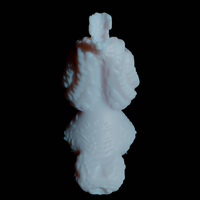 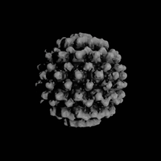 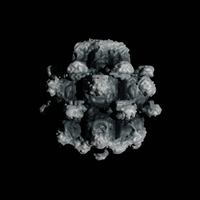

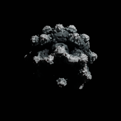 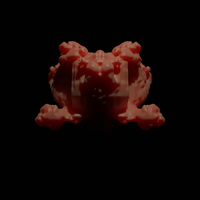 

__High resolution outputs :__

Mandelbulb grid_size=2.5, step_size=0.005, max_iterations=6, degree=8

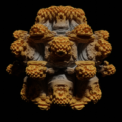

Mandelbulb grid_size=2.7, step_size=0.005, max_iterations=5, degree=3

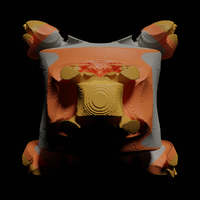

Menger Sponge :

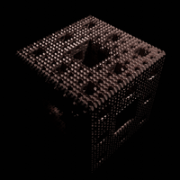 

### Terrain 

A terrain generator has been implemented based on different technologies:

__Marching cubes and noise__

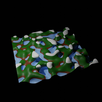

__Shader and noise based map__

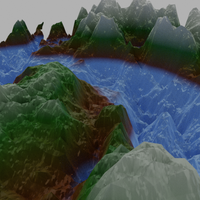

### Contributors

[Nicolas Lepy](https://github.com/nicolasLepy)

[Cyprien Plateau--Holleville](https://github.com/PlathC)