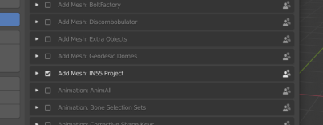
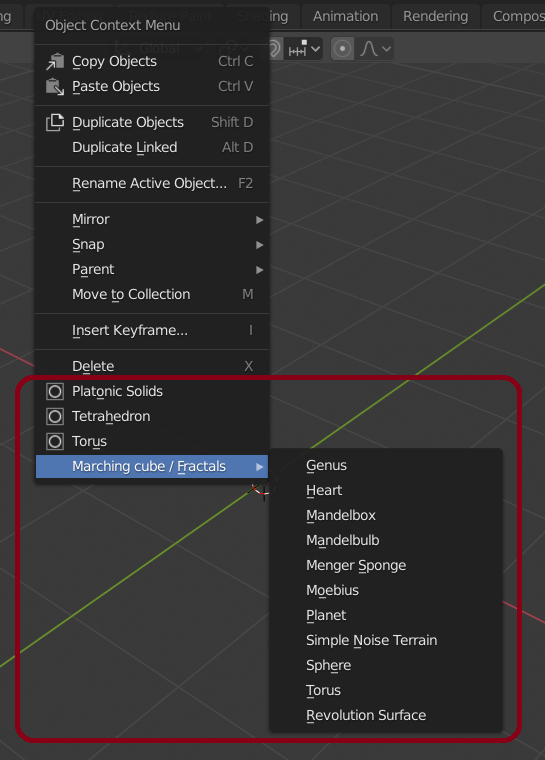
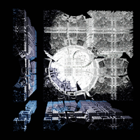

# Blender Generator

This is a learning project which aims to create procedural mesh that will be rendered in Blender.

## Features

| Feature               | Progress                                                       |
|-----------------------|----------------------------------------------------------------|
| Procedural meshes     | Torus                                                          |
| Marching cubes        | Done (slow version)                                            |
| Isosurface rendering  | Done (See implemented objects in objects/IsoSurfaceGenerator.py|
| Terrain generator     | Done                                                           |

### Install

To add this addon to your Blender you need to follow these steps :

1. Clone the projet 

```sh
	git clone https://github.com/PlathC/BlenderGenerator.git
```

2. Copy the folder inside the folder <PathToBlenderInstall>/Blender/<Version>/scripts/addons. Changes 
will be applyed on the next Blender startup.

3. Enable the addon in : Edit / Preferences / Addons / "Add Mesh : IN55 Project"

<p align="center">
	
</p>

You can now find on the right panel the panel "Marching cubes" which let you change your settings.

To create meshes with the addon you can right click on the scene and find at the bottom of the small popup
the new fields provided by the addon.

<p align="center">
	
</p>

### Procedural meshes

This project allows to create some procedural meshes:

<p align="center">
	 
</p>

### Marching cubes

The marching cubes algorithm is used to created mesh from sdf functions such as the 3D Mandelbrot
set.

__Results__:

Here are some outputs of Mandelbulb:


<p align="center">
	   
</p>

__High resolution outputs :__

<p align="center">
	  
</p>

<p align="center">
	   
</p>

### Terrain 

A terrain generator has been implemented based on different technologies:

<p align="center">
	  
</p>

### Contributors

[Nicolas Lepy](https://github.com/nicolasLepy)

[Cyprien Plateau--Holleville](https://github.com/PlathC)
